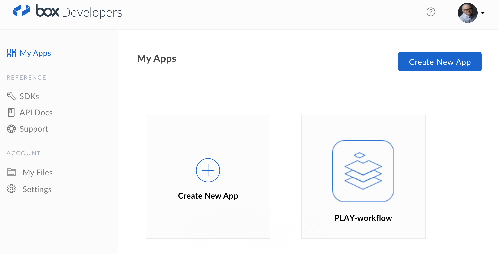
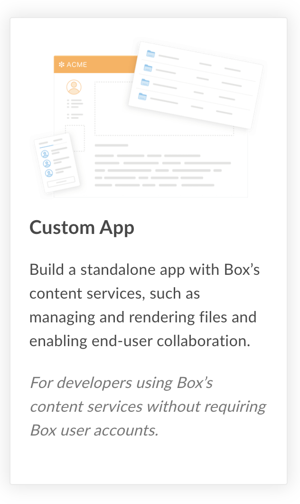
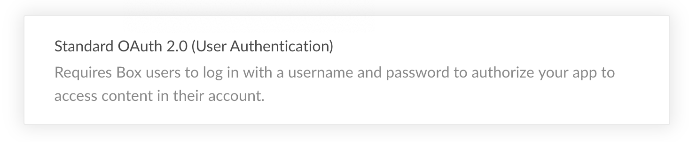
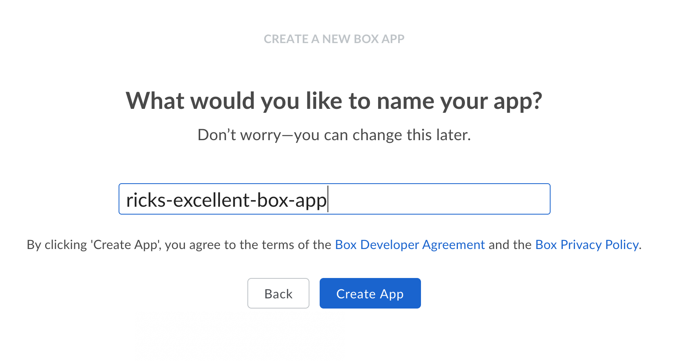
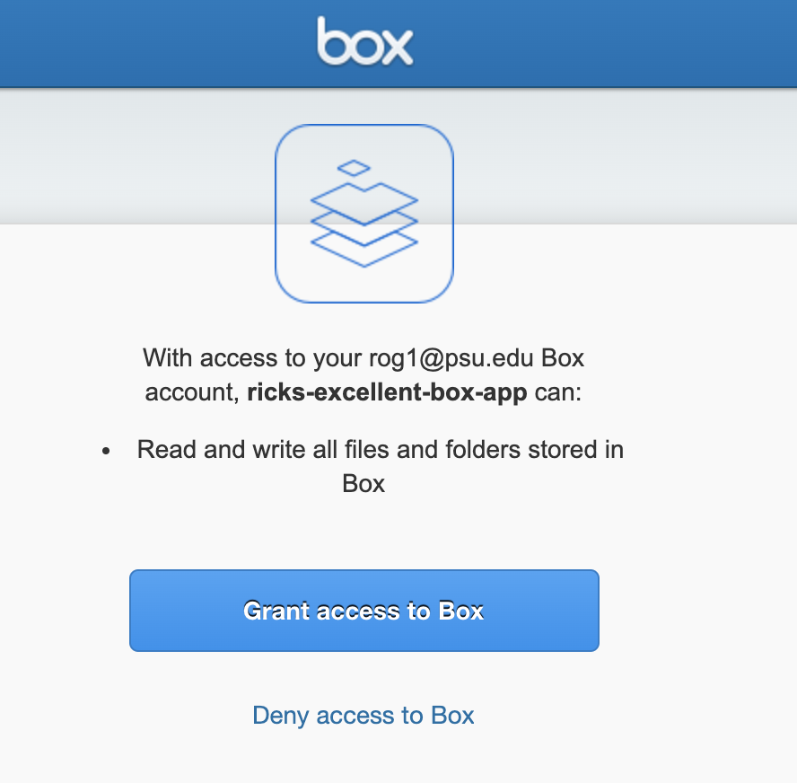
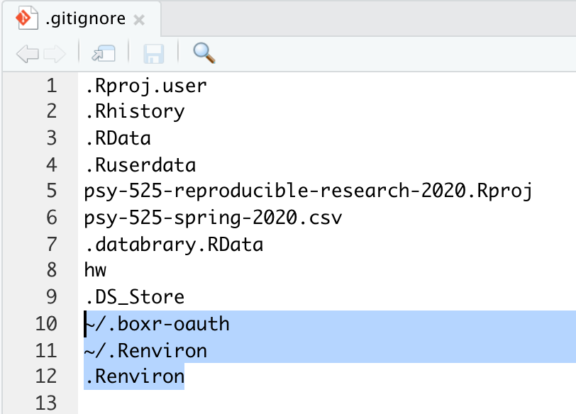

```{r setup, include=FALSE}
knitr::opts_chunk$set(echo = TRUE, fig.align = "center")
```

# Purpose

This document describes how to interact with the Box.com API.
This enables users to automate file uploading, downloading, and sharing.

# Prerequisites

- You must have a PSU Access ID (e.g., rog1).
- You must have a Box.com account associated with your PSU ID.

# Installation

## Package dependencies

We'll use the `boxr` package.

```{r install-packages}
if (!require(boxr)){
  install.packages("boxr")
}
if (!require("openssl")){
  install.packages("openssl")
}
```

## Create app on Box.com

You'll need to create an app on Box.com for your scripts to interact with. 
Visit <https://psu.app.box.com/developers/console>.
If you are not already logged in to Box.com, you'll be asked to login and provide your two-factor authentication credentials.

From the Box Developers My Apps console, press the Create New App Button.

```{r}

```

Select Custom App as the application type.

```{r}

```

Press the Next button to proceed.

Choose the method of Authentication.
For our purposes here, I recommend using Standard OAuth 2.0 (User Authentication).

```{r}

```

Press "Next" to proceed.

Name your app.

```{r}

```

Press Create App.
If you get the "Woot! Your app has been created" screen, you can do the computer happy dance if you like.
Otherwise, continue.
Press the "View Your App" button.

You app's configuration page will open.
Scroll down to the "OAuth 2.0 Credentials" section.

```{r}
knitr::include_graphics("img/box-edit-oauth-cred.png")
```

Don't edit these.
**Note:** Your credentials will differ from mine.

### Change OAuth redirect

Scroll down a bit further to the 'OAuth 2.0 Redirect URI' panel.
Edit the 'Redirect URI' to `http://localhost:8080`.
This will force your script to launch a login window for Box when you try to authenticate.
If you don't change this field, your app will not work.

Hit the 'Save Changes' button.

Scroll back up to the 'OAuth 2.0 Credentials' section again.

## Set-up credentials in R

Type the following command template into your R console, but *do not hit enter* yet:

```
boxr::box_auth(client_id="", client_secret = "")
```

From your Box.com app configuration page, copy the `Client ID` field and paste it between the quotation marks in `client_id=""`.
Then, copy the `Client Secret` and paste it between the quotation marks in `client_secret=""` above.

## Test authentication from R

*Now* press enter at the R console to execute the `boxr::box_auth()` command.
You should see a login window like the following:

```{r}

```

Press the "Grant Access to Box" button, and close the browser window with the "Authentication complete. Please close this page and return to R." message.

## Store credentials (optional)

If you want to use R to access Box in the future, you may wish to follow the instructions that appear in the R console to save these credentials in your `.Renviron` file.

- Open your `.Renviron` file via `usethis::edit_r_environ()`.
- Paste the `BOX_CLIENT_ID` and `BOX_CLIENT_SECRET` lines into the file.
- Save the file.
- Restart R (Session/Restart R).

**Note:** Your `.Renviron` file should live in your user's root/home directory and thus *not* be part of a repo you are using for version control.
However, make absolutely sure that you add `.Renviron` to your `.gitignore` file or else you could inadvertently share your credentials with the world.

Here is a screenshot from the `.gitignore` file for the class repo.
Note that the `boxr` app added its own hidden folder `~/.boxr-oauth` to the list of files to ignore.
I added my root `.Renviron` file (`~/.Renviron`) and my local (to this project/repo) `.Renviron` file just to make absolutely sure I don't leak credentials.

```{r}

```

# Test the connection to Box

Let's interact with Box!

## Authenticate

```{r authenticate}
boxr::box_auth()
```

## Creating directories

```{r list-directories}
my_dir_name <- "a-test-directory"
f <- boxr::box_dir_create(my_dir_name)
str(f)
```

That seemed to work.
We have stored the returned metadata in a variable `f`.
Now, let's create two subdirectories under that main directory.
First, we switch to the created directory and make it our temporary working directory.

```{r set-new-home-dir}
home_dir <- boxr::box_getwd()
boxr::box_setwd(f$id) # Box uses ID numbers to identify directories and files.
```

Then we create two directories, `qa`, and `data_collection`.

```{r create-dirs}
thing_1 <- boxr::box_dir_create("thing_1")
thing_2<- boxr::box_dir_create("thing_2")
```

## Listing directories

Let's retrieve a list of directories in our current working directory.
The default is the current working directory.
Note: We need to load the `tidyverse` package to have access to the pipe `%>%` operator.

```{r list-dirs}
library(tidyverse)
my_box_dirs <- boxr::box_ls()
my_box_dirs %>%
  knitr::kable(.)
```

## Create a CSV data file and upload

Let's test the upload functionality by creating a CSV data frame and uploading it to the 'thing_1' folder.

```{r create-test-data}
df <- data.frame(name = c("Tom", "Dick", "Harriet"),
                 age = c(10, 15, 20),
                 alive = c(FALSE, TRUE, TRUE))
```

```{r specify-target-dir}
target_dir <- as.data.frame(my_box_dirs) %>%
  filter(name == "thing_1")
```

Now, we'll make a temporary csv data file and upload it 

```{r upload}
readr::write_csv(df, "tmp.csv")
boxr::box_ul(target_dir$id, file = "tmp.csv")
```

### Downloading uploaded file

Let's list the files in the `thing_1` subdirectory first.

```{r list-in-dir}
target_list <- boxr::box_ls(target_dir$id)
target_list
```

Now, we try to download it.

```{r download}
boxr::box_dl(as.data.frame(target_list)$id, overwrite = TRUE, file_name = "new_tmp.csv")
```

```{r examine}
downloaded_f <- readr::read_csv("new_tmp.csv")
str(downloaded_f)
```

