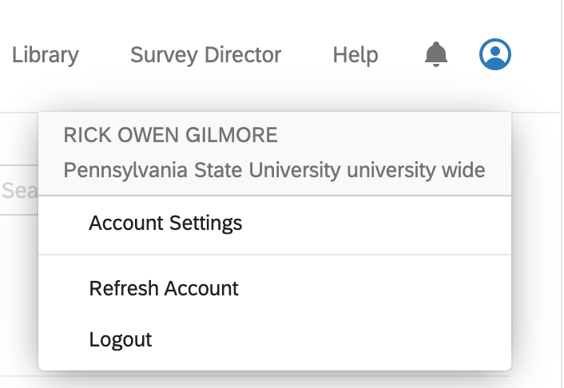
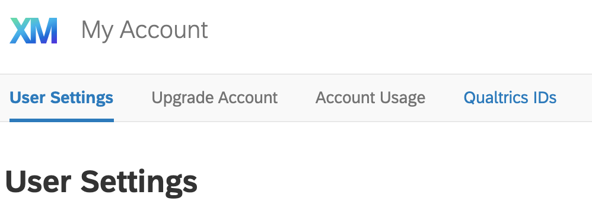
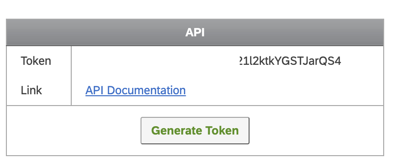

```{r setup, include=FALSE}
knitr::opts_chunk$set(echo = TRUE, fig.align = "center")
```

# Purpose

This document describes how to interact with the Qualtrics API.
This enables users to automate the downloading of Qualtrics surveys.

# Prerequisites

- An account on Penn State's Qualtrics server.
- An active survey.

# Installation

## Package dependencies

We'll use the [`qualtRics` package](https://docs.ropensci.org/qualtRics/).

```{r install-packages}
if (!require(qualtRics)){
  install.packages("qualtRics")
}

# Bring tidyverse into local namespace for pipe `%>%` operator
library(tidyverse)
```

## Login to Qualtrics

Visit <https://pennstate.qualtrics.com>.
If you have not recently logged in to a Penn State service, you will need to log in and enter your two-factor authentication (2FA) credentials.

Click on the upper right hand avatar icon and select the 'Account Settings' menu item.

```{r}

```

From the 'User Settings' page select 'Qualtrics IDs'.

```{r}

```

This page shows you the IDs for your Qualtrics surveys.
At the far right, you will also see an 'API' panel.
If the 'Token' field is blank, you will need to generate one by pressing the 'Generate Token' button.

```{r}

```

I've blurred mine for security reasons.

## Install API token in local R environment

Copy your qualtrics API key and replace `<YOUR-QUALTRICS_API_KEY>` with it in the command below.
Make sure that you place it between the double quotation marks.
Note that `base_url` has been assigned `pennstate.ca1.qualtrics.com`.

```
library(qualtRics)

qualtrics_api_credentials(api_key = "<YOUR-QUALTRICS_API_KEY>",
                          base_url = "pennstate.ca1.qualtrics.com",
                          install = TRUE)
```

Run the command.
This will store your Qualtrics credentials in `.Renviron`.
Run `readRenviron("~/.Renviron")` at the R console to reload the environment.

If you have done this before, you may get the following error: 'Error: Qualtrics credentials already exist. You can overwrite them with the argument overwrite=TRUE'.
If you think you've changed your Qualtrics api_key since you last installed these credentials, you may want to add `overwrite=TRUE` to the `qualtrics_api_credentials()` command above and re-run it.
Otherwise, proceed to test the connection.

This file should **not** be synched to GitHub for security reasons.
The default `.gitignore` for the repository includes an entry that excludes `.Renviron` from git version control.

# Test the connection

Let's interact with Qualtrics!

## Get a list of surveys

```
surveys <- all_surveys()
surveys %>%
  knitr::kable(.)
```

This should show a table of your current surveys.

## Download survey data

Pick a survey via its id and download it.
The following command picks the first survey in the list.

```
this_survey <- fetch_survey(surveyID = surveys$id[1],
                         verbose = TRUE)
```

## Examine the survey structure

Examine the structure of the downloaded `this_survey` object with the `str()` function.

```
str(this_survey)
```

You'll note that this is a list with the following fields: `StartDate`, `EndDate`, `Status`, `IPAddress` (did you know that Qualtrics automatically captures IP addresses?), `Progress`, `Duration`, `Finished`, `RecordedDate`, `ResponseId`, etc.
The specific question data are located in fields beginning with 'Q', e.g., `Q1`, `Q2`, etc.

## Separating metadata from questionnaire data

You can make your life a little easier by separating the metadata (data about the questionnaire) from the questions themselves.

```
survey_meta <- qualtRics::metadata(surveyID = surveys$id[1])
survey_quest <- qualtRics::survey_questions(surveyID = surveys$id[1])
class(survey_quest)
str(survey_quest)
```

Now, `survey_data` is a data frame we can do something with using our data munging skills.
For an example of how we're using this in my lab, see <https://github.com/gilmore-lab/sex-differences-in-motion-perception/blob/master/analysis/gather-clean-qualtrics.Rmd>.
