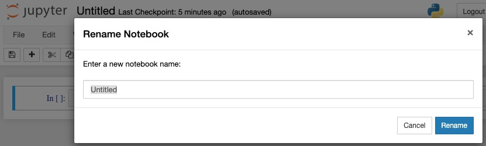
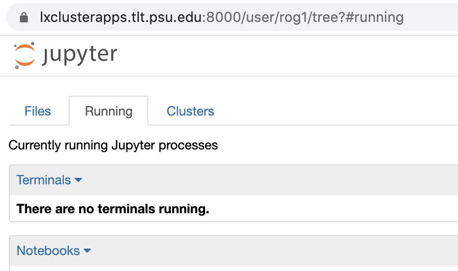
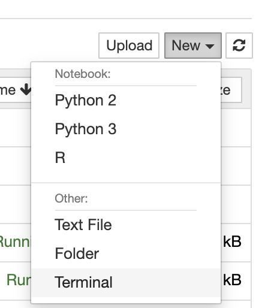
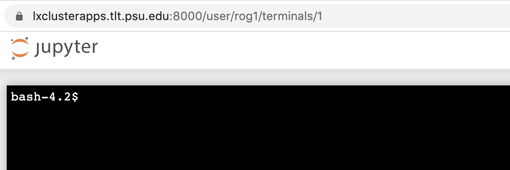

```{r setup, include=FALSE}
knitr::opts_chunk$set(echo = TRUE, fig.align = "center")
```

# Purpose

This document describes how to use Penn State's Jupyter notebook server system.

**NOTE**

As of Spring 2024, Penn State no longer supports the server described in this document.

Other mechanisms for using Jupyter notebooks must be found.

# Prerequisites

1. You must have a PSU Access ID (e.g., rog1).
2. You must have two-factor authentication set-up.
2. You must be connected to a secure, PSU-controlled network:

- `psu` wifi on campus
- hard-wired network connection on campus (e.g., from research lab or computer lab), or
- logged on to PSU's virtual private network (VPN). Penn State provides a free CiscoConnect VPN client at <https://downloads.its.psu.edu>.

# Accessing the notebook server

1. Visit <https://lxclusterapps.tlt.psu.edu:8000>.

You should see the following login screen:

```{r, fig.cap="Jupyter notebook server login screen"}
knitr::include_graphics("../img/jupyter-psu-pre-login.jpg")
```

2. Enter your PSU login credentials.
3. Verify your identity using whatever two-factor authentication (2FA) method you have chosen.

You should then see the following screen:

```{r, fig.cap="Jupyter notebook post-login"}
knitr::include_graphics("../img/jupyter-psu-post-login.jpg")
```

## Troubleshooting

More than once I have failed to connect to the server.
Why?
Because my laptop likes to jump on the `eduroam` network sometimes.
This is great when I'm traveling, but not when I need access to Penn State services.

# Creating your 1st notebook

To create your first notebook, click on the `New` drop down menu in the upper right corner.
Select Python 3.
Why not Python 2?
It's a long story, but Python 2 has been deprecated for some time.
That means it's nearing the end of the time when it will be actively supported and maintained.

Creating a new Python 3 Jupyter notebook will look like this.

```{r, fig.cap="New Jupyter notebook"}
knitr::include_graphics("../img/new-jupyter-nb.jpg")
```

I like to name my notebooks right away.
Notice the `Untitled` label on the upper left of the window.
Click on `Untitled` to open a new window where you can rename your notebook.

```{r, fig.cap="Renaming a notebook"}

```

In general, I try to name files with dashes rather than spaces, for example, `ricks-jupyter-notebook`.
The reason is that names without spaces work better with Linux-style file systems--not always, but more often.
When you have named your notebook, hit the `Rename` button to close the `Rename Notebook` window and return to the Jupyter notebook.

# Opening old notebooks

There are several ways of opening old notebooks.
I suggest clicking on the Jupyter icon in the upper left to bring up the notebook you saw when you logged in.
This should show you a list of files in your PASS space directory, but as of 2020-01-08 there is a bug.
Instead, click on the `Running` tab.
This will show you a list of `Terminals` and `Notebooks`.
Click on one of your old notebooks, and it will launch.

# Installing packages

The base configuration of Python 3 comes with many useful packages, but you may want to install others for your notebooks.

For example, to install the `censusdata` package, issue the following command within a Python notebook cell:

```
!pip install --user censusdata
```

The exclamation point `!` tells the notebook to access the system shell. 
`pip` is a package installer for Python.
The `--user` flag tells the system to install the package for the use of you, the user, alone.
And, `censusdata` is the package.
Execute the cell with command+enter, and the package will install.

## Recommended packages to install

I recommend a few basic packages to install right away.

```
!pip install --user pandas        # for data science
!pip install --user numpy         # for numerically intensive computing
!pip install --user matplotlib    # for plotting
```

You should only need to do this one time.
The changes should propagate across other notebooks you create.

## Alternative way to install packages

You may also choose to install packages using a terminal application that the Jupyter notebook environment makes available.

From the main Jupyter page, click on the "Running" tab to see whether there are any active terminals.

```{r}

```

If there are, you may click one one of them to activate it.
In this case, there are not, so we go to the "Files" tab, and select the "New" drop down menu from the far right side, and then select the "Terminal" command.

```{r}

```

A new Linux terminal opens in a new window.

```{r}

```

You can now enter your installation commands here.
**Note:**We don't need the `!` because we are not issuing this commands in the Jupyter notebook.

```
pip install --user pandas        # for data science
pip install --user numpy         # for numerically intensive computing
pip install --user matplotlib    # for plotting
```

While you're here, you might as well look around.
Try listing the directory's contents.

```
ls
```

## Accessing your PASS space

If you find a `pass-dir` using the terminal commands above, you can navigate to it using the `cd` or change directory command.
If you don't want to navigate to it, you can list the contents using `ls`.

**Note:**If you can't `ls` the directory, then you will have to do a few extra steps (HT to Matt Hansen at TLT for helping me sort this out.)

1. Run the `klist` command. If you
2. If you do not have an active Kerberos ticket, then run `kinit` at the terminal and enter your password when you see the ...@dce.psu.edu prompt.
3. Run `klist` again to verify that you have an active Kerberos ticket.
4. If you do, then you should be able to `ls pass-dir`. 

You may want to browse to pass-dir in the Jupyter interface prior to within the notebook because PASS has many nodes and they are accessed “on demand” and access might timeout within the notebook the first time.

### Uploading files to your PASS space

You can use the [WebFiles](https://webfiles.psu.edu) application to upload files to your PASS space.

# Logging out

It's not required, but it's certainly good (computer) manners to log out.
Press the `Logout` button in the upper right hand corner to do so.
That will bring you back to the login screen.
