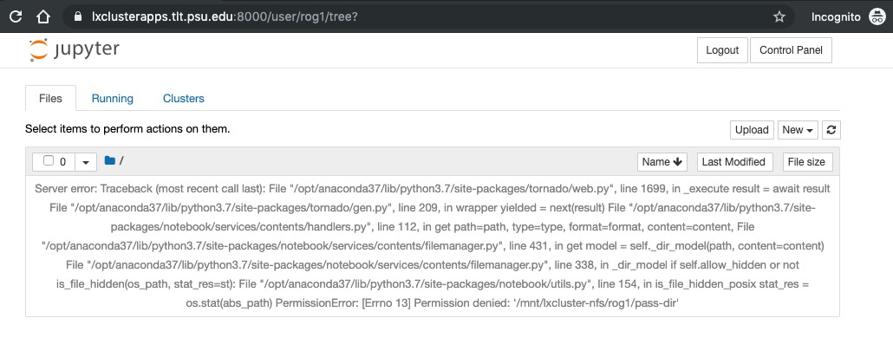
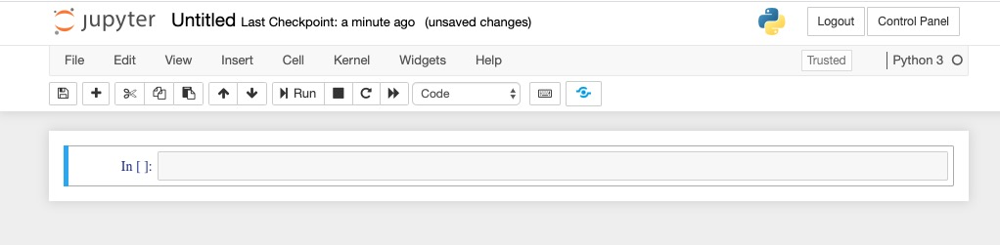

```{r setup, include=FALSE}
knitr::opts_chunk$set(echo = TRUE)
```

# Purpose

This document describes how to use Penn State's Jupyter notebook server system.

# Prerequisites

1. You must have a PSU Access ID (e.g., rog1).
2. You must have two-factor authentication set-up.
2. You must be connected to a secure, PSU-controlled network:

- `psu` wifi on campus
- hard-wired network connection on campus (e.g., from research lab or computer lab), or
- logged on to PSU's virtual private network (VPN). Penn State provides a free CiscoConnect VPN client at <https://downloads.its.psu.edu>.

# Accessing the notebook server

1. Visit <https://lxclusterapps.tlt.psu.edu:8000>.

You should see the following login screen:

```{r, fig.cap="Jupyter notebook server login screen"}
knitr::include_graphics("../img/jupyter-psu-pre-login.jpg")
```

2. Enter your PSU login credentials.
3. Verify your identity using whatever two-factor authentication (2FA) method you have chosen.

You should then see the following screen:

```{r, fig.cap="Jupyter notebook post-login"}

```

## Troubleshooting

More than once I have failed to connect to the server.
Why?
Because my laptop likes to jump on the `eduroam` network sometimes.
This is great when I'm traveling, but not when I need access to Penn State services.

# Creating your 1st notebook

To create your first notebook, click on the `New` drop down menu in the upper right corner.
Select Python 3.
Why not Python 2?
It's a long story, but Python 2 has been deprecated for some time.
That means it's nearing the end of the time when it will be actively supported and maintained.

Creating a new Python 3 Jupyter notebook will look like this.

```{r, fig.cap="New Jupyter notebook"}

```

I like to name my notebooks right away.
Notice the `Untitled` label on the upper left of the window.
Click on `Untitled` to open a new window where you can rename your notebook.
In general, I try to name files with dashes rather than spaces, for example, `ricks-jupyter-notebook`.
The reason is that names without spaces work better with Linux-style file systems--not always, but more often.
When you have named your notebook, hit the `Rename` button to close the `Rename Notebook` window and return to the Jupyter notebook.

# Opening old notebooks

There are several ways of opening old notebooks.
I suggest clicking on the Jupyter icon in the upper left to bring up the notebook you saw when you logged in.
This should show you a list of files in your PASS space directory, but as of 2020-01-08 there is a bug.
Instead, click on the `Running` tab.
This will show you a list of `Terminals` and `Notebooks`.
Click on one of your old notebooks, and it will launch.

# Logging out

It's not required, but it's certainly good (computer) manners to log out.
Press the `Logout` button in the upper right hand corner to do so.
That will bring you back to the login screen.
