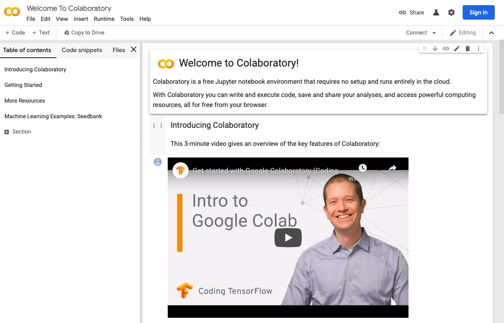

```{r setup, include=FALSE}
knitr::opts_chunk$set(echo = TRUE)
```

# Purpose

This document describes how to use the Google Colaboratory platform.
Colaboratory is a free Jupyter notebook environment that runs in the cloud.

# Prerequisites

1. You must have a Google account.
2. You must be signed-in to that account or sign-in when requested.

If you wish to use Penn State's GSuite for this service, you will need to create a Google account for this purpose as follows:

1. Visit [`https://gsuite.psu.edu`](https://gsuite.psu.edu)

```{r}
knitr::include_graphics("../img/gsuite-psu-pre-launch.jpg")
```

2. Press the red Launch button.

This will launch the Google sign-in screen.

```{r}
knitr::include_graphics("../img/gsuite-sign-in.jpg")
```

3. Enter your PSU email, e.g., `<ACCESS_ID>@psu.edu`

The following type of window should appear.

```{r}
knitr::include_graphics("../img/gsuite-org-acct.jpg")
```

4. Choose the "Select the "Organizational G Suite Account"

The PSU web services login window should appear.
You may log in as usual.

**Note**: The system may time-out the first time you do this. 
The time-out is likely due to the account creation activities that are going on in the background.

# Accessing Google Colaboratory

1. Visit [`https://colab.research.google.com`](https://colab.research.google.com)

If you are *not* logged in, you should see the following screen:

```{r, fig.cap="https://colab.research.google.com"}

```

Note the blue `Sign In` button in the upper right hand corner.  
If you are already logged-in to your Google account, you should see the following screen:

```{r, fig.cap="https://colab.research.google.com"}
knitr::include_graphics("../img/google-colaboratory-post-login.jpg")
```
