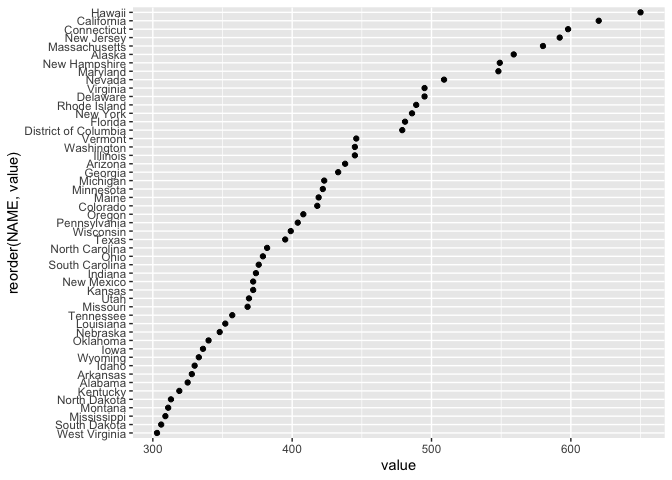
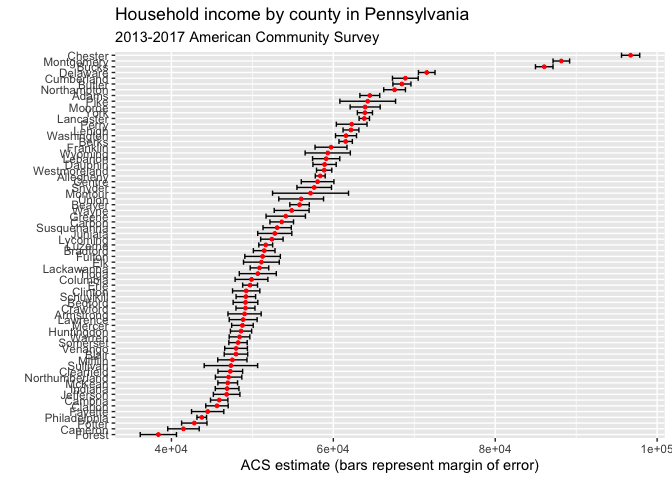

# Purpose

This document describes how to interact with U.S. Census data.
This allows researchers to collect data relevant to their research questions.

# Prerequisites

- You must have a Census API key.

Visit <https://api.census.gov/data/key_signup.html> to apply for an API key.
The key will be delivered to you via email.

# Installation

## Package dependencies

We'll use the [`tidycensus` package](https://walkerke.github.io/tidycensus/).
Most of the steps in this brief how_to come from <https://walkerke.github.io/tidycensus/articles/basic-usage.html>.


```r
if (!require(tidycensus)){
  install.packages("tidycensus")
}
```

```
## Loading required package: tidycensus
```

```r
# Load tidyverse package for pipe `%>%` operator
library(tidyverse)
```

```
## ── Attaching packages ────────────────
```

```
## ✓ ggplot2 3.3.0     ✓ purrr   0.3.3
## ✓ tibble  2.1.3     ✓ dplyr   0.8.5
## ✓ tidyr   1.0.2     ✓ stringr 1.4.0
## ✓ readr   1.3.1     ✓ forcats 0.5.0
```

```
## ── Conflicts ─────────────────────────
## x dplyr::filter() masks stats::filter()
## x dplyr::lag()    masks stats::lag()
```

## Store credentials

Run the following command at the R console, inserting the API key you received from the Census.


```r
tidycensus::census_api_key("YOUR API KEY GOES HERE")
```

To install for future sessions, run the following command:


```r
tidycensus::census_api_key("YOUR API KEY GOES HERE", install = TRUE)
```

This saves the Census API key in your `.Renviron` variable.

# Testing the package

The [tutorial](https://walkerke.github.io/tidycensus/articles/basic-usage.html) suggests the following command to test the API:


```r
med_rent_1990 <- tidycensus::get_decennial(geography = "state", 
                                         variables = "H043A001", year = 1990)
```

```
## Getting data from the 1990 decennial Census
```

```r
head(med_rent_1990)
```

```
## # A tibble: 6 x 4
##   GEOID NAME       variable value
##   <chr> <chr>      <chr>    <dbl>
## 1 01    Alabama    H043A001   325
## 2 02    Alaska     H043A001   559
## 3 04    Arizona    H043A001   438
## 4 05    Arkansas   H043A001   328
## 5 06    California H043A001   620
## 6 08    Colorado   H043A001   418
```

This downloads data about median rents by state from the 1990 Census.


```r
med_rent_1990 %>%
  ggplot(aes(x = value, y = reorder(NAME, value))) + 
  geom_point()
```



Here's another test of the package.
Let's look at household income by county in Pennsylvania from the 2018 American Community Survey (ACS).


```r
pa <- tidycensus::get_acs(geography = "county", 
              variables = c(medincome = "B19013_001"), 
              state = "PA", 
              year = 2018)
```

```
## Getting data from the 2014-2018 5-year ACS
```

```r
pa
```

```
## # A tibble: 67 x 5
##    GEOID NAME                           variable  estimate   moe
##    <chr> <chr>                          <chr>        <dbl> <dbl>
##  1 42001 Adams County, Pennsylvania     medincome    64507  1226
##  2 42003 Allegheny County, Pennsylvania medincome    58383   611
##  3 42005 Armstrong County, Pennsylvania medincome    49032  2051
##  4 42007 Beaver County, Pennsylvania    medincome    55828  1201
##  5 42009 Bedford County, Pennsylvania   medincome    49146  1524
##  6 42011 Berks County, Pennsylvania     medincome    61522   826
##  7 42013 Blair County, Pennsylvania     medincome    47969  1449
##  8 42015 Bradford County, Pennsylvania  medincome    51457  1337
##  9 42017 Bucks County, Pennsylvania     medincome    86055  1084
## 10 42019 Butler County, Pennsylvania    medincome    68472  1115
## # … with 57 more rows
```

With a bit of cleaning, we can make a nice plot.


```r
pa %>%
  mutate(NAME = gsub(" County, Pennsylvania", "", NAME)) %>%
  ggplot(aes(x = estimate, y = reorder(NAME, estimate))) +
  geom_errorbarh(aes(xmin = estimate - moe, xmax = estimate + moe)) +
  geom_point(color = "red", size =1) +
  labs(title = "Household income by county in Pennsylvania",
       subtitle = "2013-2017 American Community Survey",
       y = "",
       x = "ACS estimate (bars represent margin of error)")
```



