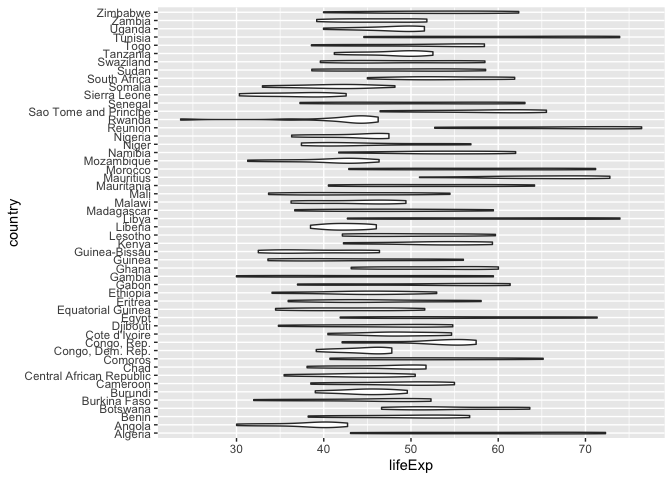

# Purpose

This document describes how to interact with the Google Drive API.
This enables users to automate file uploading, downloading, and sharing.
The [documentation site](https://googledrive.tidyverse.org/) is good.
This brief how-to borrows from it.

# Prerequisites

- You must have a personal Google account or have your Google apps account via Penn State set-up.

# Installation

## Package dependencies

We'll use the [`googledrive`](https://googledrive.tidyverse.org/) package.


```r
if (!require(googledrive)){
  install.packages("googledrive")
}
```

```
## Loading required package: googledrive
```

# Test the connection to Google Drive

## List files

List files in your Google Drive.


```r
googledrive::drive_find(n_max = 5)
```

```
## Using an auto-discovered, cached token.
## To suppress this message, modify your code or options to clearly consent to the use of a cached token.
## See gargle's "Non-interactive auth" vignette for more details:
## https://gargle.r-lib.org/articles/non-interactive-auth.html
## The googledrive package is using a cached token for rog1@psu.edu.
```

```
## # A tibble: 5 x 3
##   name              id                                          drive_resource  
## * <chr>             <chr>                                       <list>          
## 1 my-test-data      1tHx8QuoE_Zo6PMpbXBl0zWTBaihsJCvTsCLDZmrtf… <named list [34…
## 2 psy-525-test-data 1NDR8cloSMOifX7vwUhmtg6ne_ATfcFYzjhDRcTUML… <named list [34…
## 3 psy-525-test-data 1aX2aGWF6tccCCmv1_X2hx-tqC7-Zm10A1EyWlrWH6… <named list [34…
## 4 test-data         1aCDqmV2wHybSmTS8CshW_2YdA7pV8i9ilmymU6Jd2… <named list [34…
## 5 test-data         1Z14ULrUHXtva15WMiKWp1d3KrF2txEExrasF4V0Ar… <named list [34…
```

This will initiate the process of authenticating to your Google Drive account.
Depending on which Google Drive account you choose (e.g., your personal one or a PSU one associated with your access ID like `rog1@psu.edu`) there will be different sets of steps.

When you see "Authentication complete. Please close this page and return to R.", you have finished the authentication process.
If you have documents in your Google Drive under the account you chose, you will see them listed in the console.

## Upload files

Let's create a test file and then upload it.


```r
df <- data.frame(name = c("Tom", "Dick", "Harriet"),
                 age = c(10, 15, 20),
                 alive = c(FALSE, TRUE, TRUE))

readr::write_csv(df, "tmp.csv")

# Upload tmp.csv as test-data and make it a spreadsheet
(test_data <- googledrive::drive_upload(
  media = "tmp.csv",
  name = "my-525-test-data",
  type = "spreadsheet"
))
```

```
## Local file:
##   * tmp.csv
## uploaded into Drive file:
##   * my-525-test-data: 1KhjNECniCPU572Jh9TuK9H0C2VqAMtm9xRZ0B9MrT9M
## with MIME type:
##   * application/vnd.google-apps.spreadsheet
```

```
## # A tibble: 1 x 3
##   name             id                                           drive_resource  
## * <chr>            <chr>                                        <list>          
## 1 my-525-test-data 1KhjNECniCPU572Jh9TuK9H0C2VqAMtm9xRZ0B9MrT9M <named list [34…
```

We now confirm that Google drive knows about it.


```r
googledrive::drive_find(pattern = "my-525-test-data")
```

```
## # A tibble: 1 x 3
##   name             id                                           drive_resource  
## * <chr>            <chr>                                        <list>          
## 1 my-525-test-data 1KhjNECniCPU572Jh9TuK9H0C2VqAMtm9xRZ0B9MrT9M <named list [34…
```

It does, so let's download it again.


```r
new_test <- googledrive::drive_download("my-525-test-data")
```

```
## File downloaded:
##   * my-525-test-data
## Saved locally as:
##   * my-525-test-data.xlsx
```
This downloads the file as `.xlsx`.

# Sheets-specific commands

## Package installation

You will want to install the [`googlesheets4` package](https://googlesheets4.tidyverse.org/) to interact with Google sheets.


```r
if (!require(googlesheets4)){
  install.packages("googlesheets4")
}
```

```
## Loading required package: googlesheets4
```

```
## 
## Attaching package: 'googlesheets4'
```

```
## The following objects are masked from 'package:googledrive':
## 
##     request_generate, request_make
```

## Reading sheets


```r
gapm_data <- googlesheets4::read_sheet("1U6Cf_qEOhiR9AZqTqS3mbMF3zt2db48ZP5v3rkrAEJY")
```

```
## Using an auto-discovered, cached token.
## To suppress this message, modify your code or options to clearly consent to the use of a cached token.
## See gargle's "Non-interactive auth" vignette for more details:
## https://gargle.r-lib.org/articles/non-interactive-auth.html
## The googlesheets4 package is using a cached token for rog1@psu.edu.
```

```
## Reading from 'gapminder'
```

```
## 
```

The first time you call this command, the package will ask to confirm your authentication details.

Now, we can visualize the data.


```r
str(gapm_data)
```

```
## Classes 'tbl_df', 'tbl' and 'data.frame':	624 obs. of  6 variables:
##  $ country  : chr  "Algeria" "Algeria" "Algeria" "Algeria" ...
##  $ continent: chr  "Africa" "Africa" "Africa" "Africa" ...
##  $ year     : num  1952 1957 1962 1967 1972 ...
##  $ lifeExp  : num  43.1 45.7 48.3 51.4 54.5 ...
##  $ pop      : num  9279525 10270856 11000948 12760499 14760787 ...
##  $ gdpPercap: num  2449 3014 2551 3247 4183 ...
```


```r
library(ggplot2)
gapm_data %>%
  ggplot(.) +
  aes(x = lifeExp, y = country) +
  geom_violin()
```



